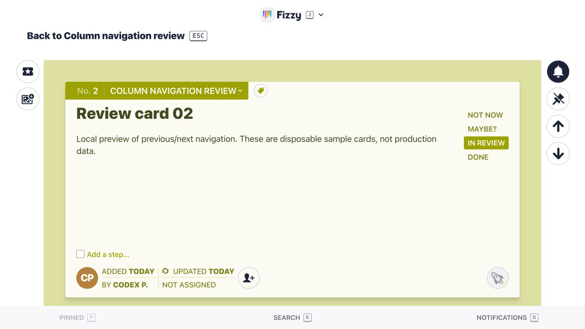
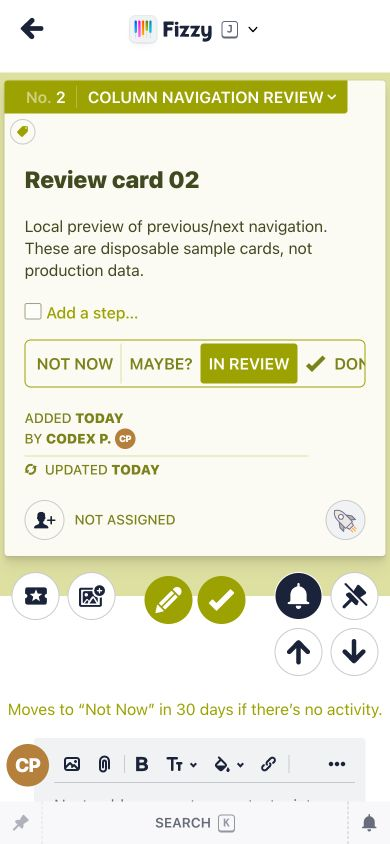

# Card column navigation — review evidence

Screenshots from an isolated local Fizzy preview with 70 disposable sample cards.
Implementation commit: c91ea677b156ec4b66d11e914b156cd02e5ac38b, based on upstream main 48f56c0453e27e825dbc55369263e6beb3e60da5.

Both arrows sit below the watch/pin controls on the right edge. Arrow strokes are approximately 15% lighter than the original arrow-up icon.

Desktop: 1280×720. Mobile: 390×844. Neither screenshot is from production.

[Detailed analysis in Polish](analysis-pl.md).

Evidence lives on this separate branch so images and review documents do not enter the application diff.
