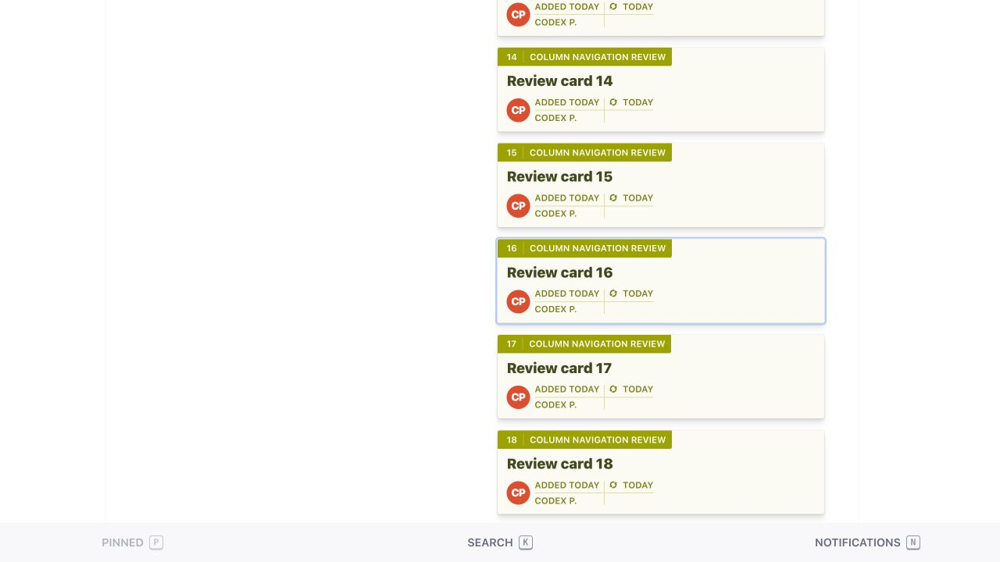
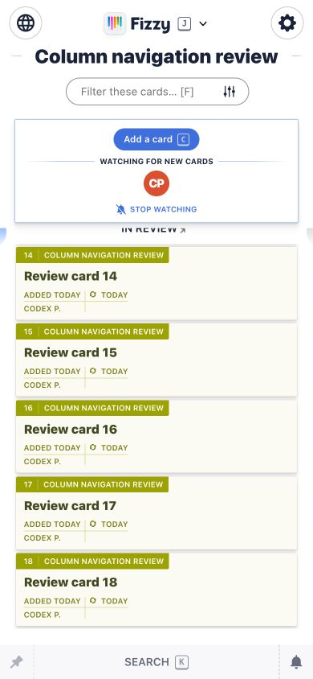
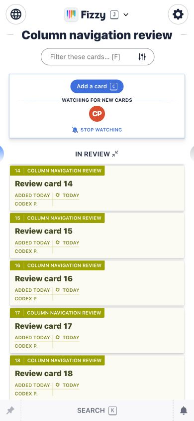

# Returning from a card: board view state

Implementation: `95ead3341594af6e5318515541bbdc985d548fa7`, based on upstream main
`48f56c0453e27e825dbc55369263e6beb3e60da5`. Independent of the card navigation PR.

The board opts out of Turbo page caching and reloads its columns and first pages
on return. Existing expansion preferences do not preserve scroll or already-loaded
pagination. The new controller remembers the expanded column IDs, horizontal
position, window/main scroll, each expanded column's list scroll and loaded page
count in sessionStorage before leaving. The key includes account-prefixed path
and query string and is scoped to the browser tab.

Restoration applies expansion without animation, reloads the previously loaded
pages through existing pagination, waits for frame loading and keyboard selection,
then restores the scroll coordinates. The normal uncached board remains current.
Pointer/keyboard/wheel interaction cancels pending scroll restoration. Missing
columns and shorter lists are tolerated; normal browser scroll bounds clamp positions.

Scope: the ordinary board column view, including Maybe. Filtered card grids and
the maximized-column page are separate views and are outside this small PR.
The existing one-custom-column expansion behavior remains in place.

Validation: **8 system tests, 56 assertions, zero failures/errors/skips**, including
the two new desktop/mobile pagination scenarios, existing keyboard focus and
back-link navigation scenarios. Rubocop and whitespace checks pass. No new
dependencies or database migrations; the full test suite was not run.

Manual browser review uses an isolated local preview and 70 disposable sample
cards, never production data. The card was on the second pagination page.
Desktop keyboard Enter → Esc restored exactly `scrollY=1755`, horizontal scroll
`0`, and the same expanded IDs. Mobile browser Back restored exactly list
`scrollTop=1248.5` and horizontal scroll `96`. Desktop viewport 1280×720;
mobile 390×844.

## Desktop before opening a card

## Desktop after returning with Esc

## Mobile before opening a card

## Mobile after browser Back

