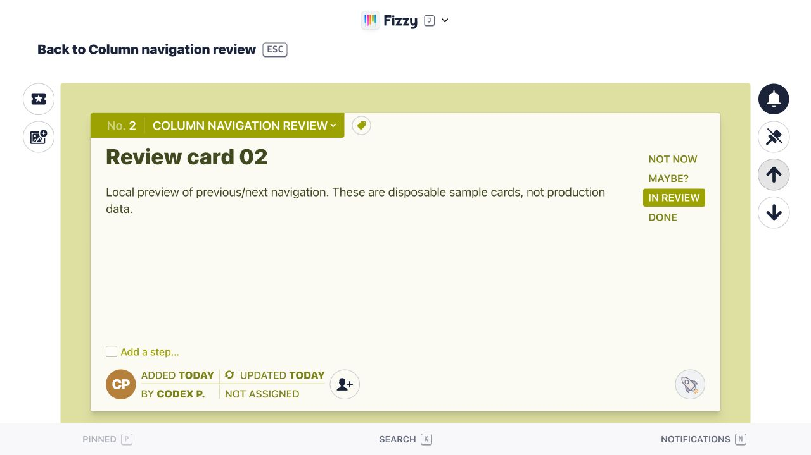
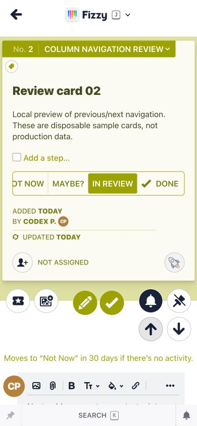

# Przejście między kartami bez migotania

Dowód pochodzi z lokalnego podglądu, z 70 przykładowymi kartami. Nie zawiera danych produkcyjnych.

Poprzednia implementacja renderowała podgląd odwiedzonej karty, potem świeży HTML z pustym miejscem na kolumny, a następnie doładowywała kolumny, dzwonek i pinezkę. Test regresyjny potwierdził dwa rendery i brak kontrolek w świeżym HTML.

Poprawka wyłącza podgląd Turbo dla widoku karty (zachowuje cache dla historii Wstecz) i umieszcza kontrolki w początkowej odpowiedzi. Dzwonek i pinezka pozostają poza współdzielonym cache karty. Cache kolumn uwzględnia ich aktualną kolekcję.

Test po poprawce: dokładnie jeden `turbo:render`, bez `data-turbo-preview`, ze wszystkimi trzema kontrolkami. Łącznie 61 testów i 369 asercji, bez błędów; obejmują nawigację, powrót do boardu, odświeżanie karty, zmianę kolumn i stan dzwonka/pinezki dla różnych użytkowników. Rubocop: 2 pliki, bez uwag.

W prawdziwej przeglądarce sprawdzono kliknięcie ↓ i ↑ na desktopie 1280×720 i w widoku telefonu 390×844. Zrzuty pokazują końcowy układ; pomiar liczby renderów pochodzi z testu systemowego.

